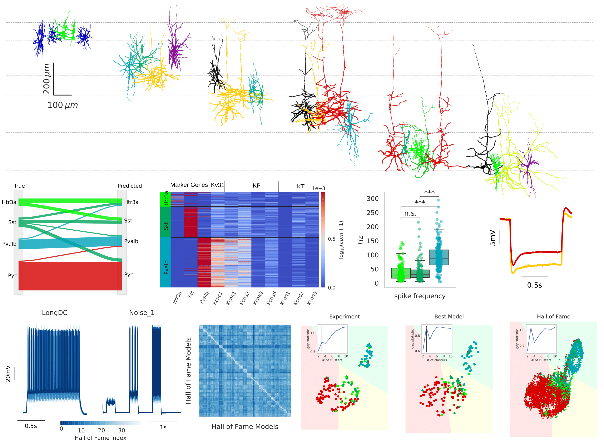

  

# All-active-Manuscript
Codes for generating figures presented in the All-active manuscript.

## Level of support
We are planning on occasional updating this tool with no fixed schedule. Community involvement is encouraged through both issues and pull requests.